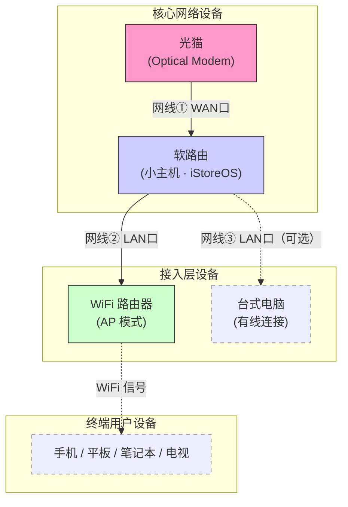

# 家庭软路由搭建教程 — 零基础保姆级指南

> 版本：v1.0 | 更新日期：2026-04-02
>
> 本教程假设你没有任何网络知识基础，会一步一步带你从购买设备到最终所有手机、电脑、电视都能顺畅使用。

---

## 目录

- [写在最前面：这个教程能帮你做到什么？](#写在最前面这个教程能帮你做到什么)
- [第一章：先搞懂几个概念（5 分钟）](#第一章先搞懂几个概念5-分钟)
- [第二章：三种方案对比 — 先选路再走路](#第二章三种方案对比--先选路再走路)
- [第三章：你需要买什么东西（购物清单）](#第三章你需要买什么东西购物清单)
- [第四章：设备怎么连接（接线指南）](#第四章设备怎么连接接线指南)
- [第五章：给软路由装系统](#第五章给软路由装系统)
- [第六章：基本网络配置（让家里能上网）](#第六章基本网络配置让家里能上网)
- [第七章：WiFi 路由器改成"只发信号"模式](#第七章wifi-路由器改成只发信号模式)
- [第八章：安装代理插件（核心功能）](#第八章安装代理插件核心功能)
- [第九章：导入你的订阅并启动](#第九章导入你的订阅并启动)
- [第十章：验证是否成功](#第十章验证是否成功)
- [第十一章：去广告（可选加分项）](#第十一章去广告可选加分项)
- [第十二章：出了问题怎么办](#第十二章出了问题怎么办)
- [第十三章：安全提醒和法律须知](#第十三章安全提醒和法律须知)
- [附录 A：方案三 ShellClash 完整安装指南](#附录-a方案三-shellclash-完整安装指南)
- [附录 B：进阶玩法（搞定基础后再看）](#附录-b进阶玩法搞定基础后再看)
- [附录 C：推荐的 OpenClash 配置模板](#附录-c推荐的-openclash-配置模板)

---

## 写在最前面：这个教程能帮你做到什么？

搭建完成后，你家的网络会变成这样：

> **所有设备（手机、电脑、iPad、电视、游戏机……）连上家里的 WiFi 就自动具备了代理能力，不需要在每台设备上装任何软件。**
>
> - 打开百度、淘宝、B站 → 正常直连，速度不受影响
> - 打开 Google、YouTube → 自动走代理，无需手动切换
> - 全家所有设备一次配好，永久生效

**一句话总结：把"翻墙"这件事从每台设备上搬到路由器上，一劳永逸。**

### 需要什么前提？

- 你需要有一个"代理服务订阅地址"（一个网址链接，通常是你付费购买代理服务后，服务商提供给你的）
- 会用浏览器、会复制粘贴，就够了

---

## 第一章：先搞懂几个概念（5 分钟）

> 不想看概念可以直接跳到 [第二章](#第二章三种方案对比--先选路再走路)，遇到不懂的再回来查。

### 什么是"软路由"？

先说你熟悉的——你家现在的 WiFi 路由器（比如小米路由器、华为路由器），它是一个**硬路由**，就是一个专用的小盒子，功能固定，厂商给什么你用什么。

**软路由 = 一台小电脑 + 路由软件**。它用一台迷你电脑（比你的鼠标大不了多少）来干路由器的活。因为它本质是电脑，所以能装各种软件，包括代理软件。

用医学做类比的话：

| | 硬路由（普通路由器） | 软路由 |
|--|---|---|
| 像什么 | 社区卫生站：能看感冒发烧，但设备有限 | 三甲医院：什么科都有，设备齐全 |
| 能干什么 | WiFi + 基本上网 | WiFi + 代理 + 去广告 + 各种高级功能 |
| 门槛 | 插上就用 | 需要配置一次（本教程教你） |

### 几个你会反复看到的术语

| 术语 | 大白话解释 |
|------|-----------|
| **光猫** | 运营商装宽带时给你的白色盒子，把光纤信号变成网线能用的信号。你不需要动它，只需要让师傅帮忙调成"桥接模式"（后面会说） |
| **WAN 口** | **WAN 口 = 连外网的口 = 插来自光猫那根网线的口**。通常标注为 WAN，或者用不同颜色区分 |
| **LAN 口** | **LAN 口 = 连自家设备的口**。你的电脑、WiFi 路由器都插这里 |
| **IP 地址** | 网络世界的"门牌号"。每个设备都有一个，比如 `192.168.10.1`。软路由的 IP 地址就是你用浏览器管理它的网址 |
| **DHCP** | 自动分配 IP 地址的功能。有了它，你的手机连上 WiFi 就能自动获得一个"门牌号"，不需要手动填 |
| **DNS** | "域名系统"。你在浏览器输入 `baidu.com`，DNS 负责查出百度的服务器在哪里（查号台的角色）|
| **AP 模式** | "无线接入点"。把 WiFi 路由器设成 AP 模式 = 让它只负责发 WiFi 信号，其他事都交给软路由 |
| **代理 / 科学上网** | 通过一个中间服务器访问目标网站。比如你 → 代理服务器（在海外） → Google |
| **分流** | 智能判断哪些网站直接连、哪些走代理。百度直连、Google 走代理，各走各的路 |
| **订阅地址** | 代理服务商给你的一个链接，里面包含了他们所有可用的代理服务器信息。你把这个链接粘贴到软路由里就行 |

### 桥接模式是什么？为什么要改？

你家现在的网络大概是这样的：

```
光猫 ──── WiFi路由器 ──── 你的手机/电脑
（光猫和路由器两个都在管事，两层管理）
```

我们要改成这样：

```
光猫(只做信号转换) ──── 软路由(管所有事) ──── WiFi路由器(只发WiFi) ──── 你的手机/电脑
（只有软路由一个在管事，一层管理，干净高效）
```

**桥接模式** = 告诉光猫"你别管上网拨号了，只做光信号转换就好，拨号的事交给后面的软路由"。

> 怎么操作：打电话给运营商（电信 10000 / 移动 10086 / 联通 10010），说"**请帮我把光猫改成桥接模式**"。师傅会远程操作或上门处理，5 分钟搞定。
>
> 如果运营商说不能改，也没关系——后面会教你不改桥接怎么用（只是稍微不那么完美）。

---

## 第二章：三种方案对比 — 先选路再走路

在动手之前，你需要先选择一种方案。三种方案都能达到"全家设备自动代理"的目标，但在成本、体验和折腾程度上差别很大。

### 总览对比

| | 方案一：x86 软路由小主机 | 方案二：买刷好 OpenWrt 的路由器 | 方案三：现有路由器 + ShellClash |
|--|---|---|---|
| **一句话描述** | 买一台迷你电脑专门做路由+代理，另用一台 WiFi 路由器发信号 | 在闲鱼买一台已经刷好代理系统的 WiFi 路由器，一体机 | 在你家现有的路由器上装一个代理脚本，不买任何新设备 |
| **花费** | ¥500~900 | ¥100~400 | ¥0 |
| **需要几台设备** | 2 台（软路由 + WiFi 路由器） | 1 台 | 0 台（用现有的） |
| **折腾程度** | 中等（本教程主线教程） | 最低（买回来粘贴订阅就用） | 低~中（需要开 SSH，敲几行命令） |
| **代理性能** | 最好（千兆跑满无压力） | 受限（300M 以上宽带可能跑不满） | 受限（和方案二类似） |
| **WiFi 质量** | 最好（WiFi 路由器用原厂系统，信号稳定） | 可能变差（OpenWrt 的 WiFi 驱动通常不如原厂） | 不影响（路由器保持原厂系统） |
| **稳定性** | 最好（专业设备干专业的事） | 一般（一台弱设备同时干三件事） | 一般（路由器固件更新后可能需要重装） |
| **可玩性** | 最高（去广告、NAS、内网穿透等） | 中等 | 最低（只有基本代理功能） |
| **推荐指数** | ⭐⭐⭐⭐⭐ | ⭐⭐⭐ | ⭐⭐⭐⭐ |

---

### 方案一：x86 软路由小主机（推荐）

#### 是什么

买一台迷你电脑（x86 架构，CPU 通常是 Intel N100），装上专业的路由系统 iStoreOS，用它来做家庭网络的"大脑"——管拨号、管分流、管代理。你家原来的 WiFi 路由器降级为"只发 WiFi 信号"的角色。

#### 网络结构

```
光猫 ──▶ 软路由小主机(iStoreOS + OpenClash) ──▶ WiFi路由器(AP模式，只发信号)
              ▲ 大脑：拨号/代理/分流/去广告                  ▲ 只管无线信号
```

#### 优点

- **性能最好**：N100 CPU 处理代理加解密绑绑有余，千兆宽带轻松跑满，不影响网速
- **WiFi 最好**：WiFi 路由器保持原厂系统，信号稳定性和覆盖范围都不打折
- **功能最全**：能装 OpenClash（有完整 Web 管理界面）、去广告、内网穿透等各种插件
- **最稳定**：路由和 WiFi 分开，互不干扰，一台出问题不影响另一台
- **维护方便**：所有配置在浏览器里点击完成，有完整的中文界面
- **一劳永逸**：配好以后基本不用管，可以用好几年

#### 缺点

- **要花钱**：软路由 ¥400~700 + WiFi 路由器 ¥0~200（已有就不用买），总计 ¥500~900
- **多一台设备**：需要在弱电箱或桌面多放一个小盒子（很小，比手掌大一点）
- **初始配置需要时间**：大约 1~2 小时（本教程的主线内容就是教你这个）

#### 适合谁

- 愿意花几百块换一个长期省心方案的人
- 家里宽带 500M 以上，对网速有要求的人
- 想一步到位，以后还想折腾去广告、NAS 等功能的人

---

### 方案二：买刷好 OpenWrt 的 WiFi 路由器（一体机）

#### 是什么

在闲鱼上买一台已经刷好 OpenWrt 系统、预装了 OpenClash 或 PassWall 的 WiFi 路由器。一台设备同时负责 WiFi + 路由 + 代理，买回来粘贴订阅链接就能用。

常见的机型：小米 AX3000T、红米 AX6S、一些 MT7981/MT7986 芯片的路由器。

#### 网络结构

```
光猫 ──▶ 刷好OpenWrt的路由器(路由 + WiFi + 代理 全在一台)
              ▲ 一台设备干所有事
```

#### 优点

- **最省事**：到手即用，粘贴订阅地址就能工作
- **最便宜**：闲鱼 ¥100~300 就能搞定
- **只有一台设备**：不占额外空间
- **有 Web 界面**：因为是 OpenWrt 系统，OpenClash 的完整管理界面都有

#### 缺点

- **性能瓶颈严重**：路由器的 CPU（如 MT7981）性能远不如 x86 的 N100。代理的加解密需要吃 CPU，和 WiFi、路由抢资源。500M 以上宽带大概率跑不满
- **WiFi 可能变差**：OpenWrt 对很多国产路由器的 WiFi 驱动支持不完善，信号强度和稳定性通常不如原厂固件。Mesh 组网、160MHz 频宽等高级功能基本丢失
- **内存/闪存紧张**：路由器通常只有 128~256MB 内存，OpenClash 加上规则集后就快满了，容易卡顿或崩溃
- **安全风险**：闲鱼卖家刷的固件你无法确认是否干净，可能被植入后门。你的所有网络流量都经过这台设备——如果有后门，你的账号密码都可能泄露
- **变砖风险**：路由器刷坏了就成砖头了，不像 x86 小主机随时可以重装
- **刷回原厂麻烦**：有些型号刷了 OpenWrt 后很难刷回原厂系统

> ⚠️ **安全提醒**：如果选择这个方案，买回来后强烈建议：
> 1. 第一时间修改管理密码
> 2. 最好自己重新刷一遍干净的 OpenWrt 固件（在 B 站搜"你的路由器型号 + 刷 OpenWrt"能找到教程）
> 3. 绝对不要用卖家附送的"免费代理节点"，不安全

#### 适合谁

- 预算非常有限（200 元以内搞定）
- 宽带 300M 以下，对速度要求不高
- 不想买额外设备，不想折腾太多
- 愿意接受 WiFi 质量可能下降的代价

---

### 方案三：现有路由器 + ShellClash（零成本）

#### 是什么

**ShellClash** 是一个轻量级的 Shell 脚本，可以安装在几乎所有基于 Linux 的设备上——包括你家**现有的路由器**（只要能开 SSH）。它不需要刷机、不需要换系统，在路由器原厂系统上直接运行。

和 OpenClash 的最大区别：OpenClash 是 OpenWrt 专属的带完整 Web UI 的图形化插件；ShellClash 是一个跨平台的命令行脚本，通过交互式菜单操作，也可以开一个简易 Web 面板。

#### 网络结构

```
光猫 ──▶ 你现有的路由器(原厂系统 + ShellClash 脚本)
              ▲ 路由器不用刷机，原厂系统不变
```

#### 优点

- **零成本**：不用买任何新设备
- **不用刷机**：路由器保持原厂系统，WiFi、Mesh 等所有原厂功能完好
- **安装简单**：只需要一行命令
- **风险低**：不喜欢了随时卸载，路由器毫无影响
- **覆盖面广**：支持小米、华硕、TP-LINK 等多种品牌的路由器，也能装在 NAS、电视盒子、甚至 Android 手机上
- **很轻量**：占用极小的内存和存储空间

#### 缺点

- **没有完整的图形界面**：主要靠命令行交互菜单操作。虽然可以开一个简易 Web 面板（YACD/Metacubexd）来切节点和看连接，但没有 OpenClash 那种集成在路由器管理后台里的完整体验
- **需要路由器能开 SSH**：不是所有路由器都支持，需要先查查你的型号能不能开（小米、华硕大部分可以；华为、TP-LINK 大部分不行）
- **性能受限**：和方案二一样，路由器 CPU 弱，500M 以上宽带可能跑不满
- **路由器系统更新后可能失效**：路由器固件升级后 ShellClash 可能需要重新安装
- **高级功能配置需要编辑文件**：分流规则、DNS 设置等高级配置需要手动编辑 YAML 文件，没有图形界面可以点
- **社区相对小**：遇到问题能找到的中文教程比 OpenClash 少一些

#### 哪些路由器能装 ShellClash？

| 品牌 | 能否开 SSH | 说明 |
|------|-----------|------|
| **小米/红米** | 大部分可以 | 需要绑定小米账号后在后台开启，部分新型号需要降级固件后开启 |
| **华硕** | 可以 | 原厂固件和梅林固件都支持 SSH |
| **TP-LINK** | 大部分不行 | 官方锁死了 SSH，少数老型号可以 |
| **华为/荣耀** | 不行 | 完全封闭 |
| **网件(Netgear)** | 可以 | 支持 Telnet/SSH |

> 不确定你的路由器能不能装？在搜索引擎搜 **"你的路由器型号 + SSH"** 或 **"你的路由器型号 + ShellClash"**，如果能找到教程就说明可以。

#### 适合谁

- 一分钱都不想花的人
- 路由器恰好支持 SSH（小米/华硕用户比较幸运）
- 宽带 300M 以下，对性能要求不高
- 动手能力还行，不怕看命令行
- 想先低成本试试效果，以后再决定要不要买软路由

---

### 三种方案怎么选？一张图决定

```
你愿意花 ¥500~900 买设备吗？
│
├── 愿意 ──▶ 方案一：x86 软路由（最佳体验，推荐）
│             本教程第三章~第十章 手把手教你
│
└── 不愿意
     │
     ├── 你的路由器能开 SSH 吗？（搜"型号+SSH"看看）
     │    │
     │    ├── 能 ──▶ 方案三：ShellClash（零成本，效果不错）
     │    │          看 附录 A 的安装指南
     │    │
     │    └── 不能 ──▶ 方案二：闲鱼买刷好的路由器（最省事）
     │                 闲鱼搜"你的路由器型号 + OpenWrt"
     │                 买回来后参考第九章粘贴订阅
     │
     └── 不确定 ──▶ 先试方案三，不行再考虑方案一或方案二
```

### 三种方案的核心差异一句话总结

| 维度 | 方案一（x86 软路由） | 方案二（刷好的路由器） | 方案三（ShellClash） |
|------|---|---|---|
| 花钱 | ¥500~900 | ¥100~300 | ¥0 |
| 操作界面 | 完整 Web UI，全程浏览器点击 | 完整 Web UI | 命令行菜单 + 简易 Web 面板 |
| WiFi 影响 | 不影响（分开的设备） | 可能变差 | 不影响（原厂系统） |
| 跑满千兆 | 轻松 | 困难 | 困难 |
| 长期稳定性 | 最好 | 一般 | 一般 |
| 安全性 | 自己装的系统，放心 | 别人刷的固件，有风险 | 开源脚本，透明 |

**下面的教程以方案一（x86 软路由）为主线展开。如果你选择方案三 ShellClash，请直接跳到 [附录 A](#附录-a方案三-shellclash-完整安装指南)。如果你选择方案二，到手后从 [第九章](#第九章导入你的订阅并启动) 开始看即可。**

---

## 第三章：你需要买什么东西（购物清单）

> 本章针对**方案一**。方案二去闲鱼搜"路由器型号 + OpenWrt"即可。方案三不需要买东西。

### 必买清单

你只需要买 **两样东西**，加起来 600~1000 元左右：

#### 1. 软路由小主机（推荐：N100 四网口）

> 在淘宝/京东/拼多多搜索：**"N100 软路由"** 或 **"倍控 N100"**

推荐配置：

| 项目 | 推荐 | 说明 |
|------|------|------|
| CPU | Intel N100 | 当前性价比最高的选择，功耗极低（一年电费约 30 元） |
| 内存 | 8GB | 够用了 |
| 硬盘 | 128GB 以上的 SSD | 不需要很大 |
| 网口数量 | 4 个（推荐） | 最少要 2 个。4 个更灵活 |
| 价格 | ¥400~700 | 带内存和硬盘的成品机 |

> **选购建议**：直接买"准系统 + 8G 内存 + 128G SSD"的套装，到手即用。品牌推荐倍控、畅网，都是成熟的软路由品牌。
>
> **闲鱼 vs 全新**：闲鱼上 ¥350~500 能买到成色不错的二手 N100 小主机，性价比更高。买回来自己装系统（第五章会教），比买"刷好系统"的更安全放心。

#### 2. WiFi 路由器（如果你家已经有，可以用现有的）

软路由没有 WiFi 功能（也不需要有），所以你还需要一个普通 WiFi 路由器来发射无线信号。

| 预算 | 推荐型号 | 说明 |
|------|---------|------|
| ¥150~200 | 小米 AX3000T | 性价比之王，完全够用 |
| ¥200~400 | TP-LINK XDR5430 | 信号覆盖更好 |

> 如果你家已有路由器，先不用买新的，现有的就能用。

#### 3. 网线（2~3 根）

普通的六类网线就行，淘宝几块钱一根。你需要：
- 光猫 → 软路由：1 根
- 软路由 → WiFi 路由器：1 根
- （可选）软路由 → 台式电脑：1 根

### 完整购物清单汇总

| 物品 | 数量 | 预算 | 哪里买 |
|------|------|------|--------|
| N100 软路由小主机（含 8G 内存+128G 硬盘） | 1 台 | ¥400~700 | 淘宝搜"倍控 N100 软路由" |
| WiFi 路由器 | 1 台 | ¥0~200（已有就不用买） | 京东/淘宝 |
| 六类网线 1~2米 | 2~3 根 | ¥10~20 | 淘宝/京东 |
| **合计** | | **¥500~900** | |

---

## 第四章：设备怎么连接（接线指南）

### 总共就插 3 根线

收到设备后，按下图把线插好：



### 具体怎么插

**网线 ①：光猫 → 软路由**

```
光猫的 LAN 口（任意一个）──────▶ 软路由的 WAN 口
```

- 软路由背面的网口通常会标注哪个是 WAN。如果没标注，**最左边或最右边**的通常是 WAN 口（查一下说明书或问卖家）

**网线 ②：软路由 → WiFi 路由器**

```
软路由的 LAN 口（任意一个）──────▶ WiFi 路由器的 LAN 口
```

> ⚠️ **注意！** 这根线要插在 WiFi 路由器的 **LAN 口**，不是 WAN 口！这是很多人会插错的地方。

**网线 ③（可选）：软路由 → 台式电脑**

```
软路由的另一个 LAN 口 ──────▶ 台式电脑的网口
```

### 插完线后

1. 给光猫通电（应该本来就开着）
2. 给软路由通电（插上电源即可）
3. 给 WiFi 路由器通电
4. 用一根网线把你的电脑连到软路由的 **LAN 口**

> 先不要急着用 WiFi，我们先用网线连电脑来做配置。配置好以后就可以拔掉网线用 WiFi 了。

---

## 第五章：给软路由装系统

### 选什么系统？

我们用 **iStoreOS**。它是专为软路由设计的系统，全中文界面，有应用商店，就像手机的"应用市场"一样可以点击安装各种功能。

### 第一步：下载系统镜像

1. 在你的电脑上打开浏览器
2. 访问：`https://fw.koolcenter.com/iStoreOS/x86_64/`
3. 找到文件名里包含 `combined-squashfs` 的 `.img.gz` 文件，点击下载
4. 下载完后，解压得到一个 `.img` 文件

> 文件名大概长这样：`istoreos-x86-64-generic-squashfs-combined.img.gz`
>
> 解压方法：Windows 用户右键 → "解压到当前文件夹"（需要安装 7-Zip 或 WinRAR）

### 第二步：把系统写入 U 盘

你需要一个 **2GB 以上的 U 盘**（U 盘里的数据会被清空，请先备份）。

1. 下载工具 **Rufus**：访问 `https://rufus.ie/`，点击下载
2. 插入 U 盘
3. 打开 Rufus：
   - **设备**：选择你的 U 盘（注意别选错成硬盘！）
   - **引导类型**：点"选择"，找到你刚解压的 `.img` 文件
   - **分区类型**：选 **GPT**
   - **目标系统**：选 **UEFI**
4. 点击 **开始**，等待完成

> ⚠️ **千万注意**：确认选择的是 U 盘而不是你电脑的硬盘！看一下容量就能区分。

### 第三步：设置软路由从 U 盘启动

1. 把写好的 U 盘插到软路由上
2. 给软路由接上显示器和键盘（临时用一下，装完系统就可以拔掉）
3. 软路由通电开机
4. 开机时反复按 **Del** 键或 **F2** 键进入 BIOS 设置界面

   > 不同品牌的按键可能不同，常见的有 Del、F2、F7、F12。如果不确定，开机后每个都按按试试。

5. 在 BIOS 中找到以下设置并修改：

| 设置项 | 改成什么 | 在哪里找 |
|--------|---------|---------|
| Boot Mode（启动模式） | UEFI | Boot 菜单下 |
| Boot Order（启动顺序） | U 盘放第一位 | Boot 菜单下 |
| Secure Boot（安全启动） | Disabled（关闭） | Security 菜单下 |
| AC Power Loss（来电恢复） | Power On（来电自动开机） | Advanced 菜单下 |

6. 按 **F10** 保存并退出，软路由会自动重启

> **"来电自动开机"非常重要！** 这样万一停电了，来电后软路由会自己启动，你不需要手动按开关。

### 第四步：安装系统到硬盘

软路由从 U 盘启动后，你会看到一个黑色的命令行界面。

**方法一（推荐）：先用 U 盘启动，再通过网页安装到硬盘**

1. 等待 1 分钟让系统完全启动
2. 在你的电脑浏览器中访问 `http://192.168.100.1`
3. 如果能打开管理页面 → 在页面中找到：`系统 → 磁盘管理 → 写入硬盘`
4. 按提示操作，等写入完成后拔掉 U 盘，重启

**方法二：直接用命令写入**

如果你面前有软路由的屏幕和键盘，在命令行输入：

```bash
lsblk
```

你会看到类似这样的输出：

```
NAME   SIZE  TYPE
sda    128G  disk    ← 这是软路由内置的硬盘
sdb    16G   disk    ← 这是你的 U 盘
```

> 通过容量来判断哪个是硬盘、哪个是 U 盘。

然后输入（注意把 sda 替换为你实际看到的硬盘名）：

```bash
dd if=/dev/sdb of=/dev/sda bs=4M status=progress
```

等进度走完后：

```bash
sync
reboot
```

重启时拔掉 U 盘。

> ⚠️ **这步容易出错的地方**：`of=` 后面一定要写硬盘（sda），不是 U 盘。写反了会把硬盘内容覆盖到 U 盘上。**通过容量区分！128G 的是硬盘，8G/16G 的是 U 盘。**

### 第五步：首次登录

系统装好后，软路由会自动启动。等待约 1 分钟。

1. 确保你的电脑用网线连在软路由的 **LAN 口**
2. 打开电脑浏览器，地址栏输入：

```
http://192.168.100.1
```

3. 你会看到 iStoreOS 的登录页面：
   - 用户名：`root`
   - 密码：`password`（有些版本是空密码，直接点登录）

4. 登录成功后你会看到一个中文的管理界面，有点像路由器的管理后台

> ⚠️ **如果打不开这个页面**，按顺序检查：
>
> 1. 网线是不是插在了 **LAN 口**？（不是 WAN 口）
> 2. 电脑是否已经获取到了 IP 地址？
>    - Windows：按 `Win + R`，输入 `cmd`，回车，输入 `ipconfig`，看看有没有 `192.168.100.x` 的地址
>    - Mac：打开"系统设置 → 网络"，看有线网络的 IP 地址
> 3. 如果还是不行，手动给电脑设置 IP：
>    - IP 地址：`192.168.100.2`
>    - 子网掩码：`255.255.255.0`
>    - 网关：`192.168.100.1`

**恭喜！软路由系统安装完成。接下来我们一起把它配置好。**

此时你可以拔掉显示器和键盘了，后面全部在电脑浏览器里操作。

---

## 第六章：基本网络配置（让家里能上网）

### 第一步：修改软路由的管理地址

> **为什么要改？** 软路由默认地址是 `192.168.100.1`，可能和光猫的地址冲突（光猫通常也是 `192.168.1.1` 或 `192.168.100.1`）。改一下避免"撞车"。

**操作步骤**：

1. 在管理页面点击：`网络` → `接口`
2. 找到 **LAN** 那一行，点右边的 **编辑**
3. 把 `IPv4 地址` 从 `192.168.100.1` 改成 `192.168.10.1`
4. `子网掩码` 保持 `255.255.255.0` 不变
5. 页面最下方点 **保存&应用**

> ⚠️ **改完后页面会断开！** 这是正常的，因为地址变了。
>
> 等待 30 秒后，在浏览器地址栏输入新地址访问：
>
> ```
> http://192.168.10.1
> ```
>
> 如果还是打不开，把电脑网线拔了重插一下（让电脑重新获取新的 IP 地址）。

### 第二步：设置上网方式（让软路由连上互联网）

#### 情况 A：光猫已经改成桥接模式（推荐）

如果你已经让运营商把光猫改成了桥接模式，那你需要在软路由上做"拨号上网"。

1. 点击：`网络` → `接口`
2. 找到 **WAN** 那一行，点 **编辑**
3. `协议` 选择 **PPPoE**
4. 填写你的宽带账号和密码

   > 宽带账号和密码在哪里？就是装宽带时运营商给你的那张纸上的。如果找不到，打运营商客服电话问。

5. 点 **保存&应用**
6. 等待 10~30 秒

**怎么判断拨号成功了？** 回到 `网络 → 接口` 页面，看 WAN 那一行：

- 如果显示了一个 IP 地址（比如 `115.xxx.xxx.xxx`）→ 成功了！
- 如果显示"未连接"或没有 IP → 账号密码可能填错了，重新检查

#### 情况 B：光猫没有改桥接（保持默认）

如果运营商说改不了桥接，也能用，只是稍微不那么完美。

1. 点击：`网络` → `接口`
2. 找到 **WAN** 那一行，点 **编辑**
3. `协议` 选择 **DHCP 客户端**
4. 点 **保存&应用**

这种情况下，光猫负责拨号，软路由从光猫自动获取 IP。

> 判断成功：WAN 行出现了一个 IP 地址（通常是 `192.168.1.x`）。

### 第三步：修改登录密码

这步很重要！默认密码人人都知道，要改成你自己的。

1. 点击：`系统` → `管理权限`
2. 在"主机密码"处输入新密码（两次）
3. 点 **保存**

### 第四步：验证能不能上网

在你的电脑浏览器里打开 `https://www.baidu.com`：

- 打开了 → 上网配置成功！
- 打不开 → 看 [第十二章的故障排查](#第十二章出了问题怎么办)

---

## 第七章：WiFi 路由器改成"只发信号"模式

### 为什么要改？

现在的结构是：软路由负责管理所有网络事务，WiFi 路由器只需要当一个"无线信号发射器"（AP 模式）。如果 WiFi 路由器也在管事（分配 IP、做防火墙），两个管家同时干活就会冲突。

### 操作步骤

> 不同品牌的路由器界面不一样，下面给出通用步骤。如果不确定，搜索"你的路由器型号 + AP模式"就能找到具体教程。

1. 先把 WiFi 路由器断开和软路由的连接，**单独用网线连到电脑**
2. 用浏览器登录 WiFi 路由器的管理页面（通常是 `192.168.1.1` 或 `192.168.0.1`，看路由器底部标签）
3. 做以下修改：

| 操作 | 目的 | 怎么找 |
|------|------|--------|
| **关闭 DHCP 服务器** | 让软路由来分配 IP，这里不要抢活 | "LAN 设置"或"DHCP 设置"里关闭 |
| **修改 LAN IP 地址为 `192.168.10.2`** | 让它和软路由在同一个网段，且不冲突 | "LAN 设置"里修改 |
| **设置 WiFi 名称和密码** | 起一个你喜欢的 WiFi 名字 | "无线设置"里 |

> 很多路由器有个快捷选项叫"AP 模式"或"有线中继模式"，直接选它就行，以上设置会自动完成。
>
> 小米路由器：`常用设置 → 上网设置 → 工作模式切换 → 有线中继模式`
>
> TP-LINK：`应用管理 → AP 模式`

4. 保存设置
5. 用网线把 WiFi 路由器的 **LAN 口**（不是 WAN 口！）连到软路由的 LAN 口
6. 试试手机能不能搜到你设置的 WiFi 名称

> ⚠️ **最容易搞错的地方**：
>
> - 网线一定插 WiFi 路由器的 **LAN 口**！不是 WAN 口！
> - 如果你的路由器设成 AP 模式后 WAN 口自动变成了 LAN 口，那插哪个都行（小米路由器就是这样）
> - 改完之后路由器的管理地址变成了 `192.168.10.2`，以后要管理它就用这个地址

---

## 第八章：安装代理插件（核心功能）

> 本章针对**方案一**（x86 软路由 + iStoreOS）。方案二到手已经装好了。方案三请看 [附录 A](#附录-a方案三-shellclash-完整安装指南)。

### 选哪个插件？

我们用 **OpenClash**。理由：界面友好、支持订阅导入、一键更新、社区活跃。

### 安装方法：通过应用商店（超简单）

iStoreOS 自带应用商店，装插件就像手机装 App 一样：

1. 在软路由管理页面，找到 **iStore**（通常在首页或侧边栏）
2. 在搜索框输入 `OpenClash`
3. 点击 **安装**
4. 等待安装完成（通常 1~2 分钟）

安装成功后，左侧菜单的 **服务** 下面会出现 **OpenClash** 选项。

> ⚠️ **如果 iStore 里找不到 OpenClash**：
>
> 可能是网络问题导致应用列表加载不出来。试试：
> 1. 刷新页面
> 2. 等几分钟再试
> 3. 如果反复不行，看下面的手动安装方法

### 备选安装方法：手动安装

如果应用商店装不了，需要用"命令行"安装。别怕，就是复制粘贴几行文字。

**怎么打开命令行？**

方法一（推荐）：在软路由管理页面找到 `系统 → TTYD 终端`，直接在网页里出现一个黑色窗口，输入用户名 `root` 和密码即可。

方法二：在电脑上使用 SSH 工具连接（Windows 用户可用 PuTTY，Mac 用户打开终端输入 `ssh root@192.168.10.1`）。

进入命令行后，依次复制粘贴以下命令（每输入一行按回车）：

```bash
opkg update
```

等它执行完（会输出很多文字，等到光标停下来再继续），然后：

```bash
opkg install coreutils-nohup bash curl ca-certificates ipset ip-full libcap libcap-bin ruby ruby-yaml kmod-tun kmod-inet-diag unzip luci-compat luci luci-base
```

> 这行很长，请完整复制，不要漏掉。

然后去 OpenClash 的 GitHub 页面下载最新安装包：
- 地址：`https://github.com/vernesong/OpenClash/releases`
- 找到最新版本，下载文件名为 `luci-app-openclash_xxxx_all.ipk` 的文件
- 把这个文件上传到软路由：在管理页面 `系统 → 文件传输` 上传

最后在命令行安装：

```bash
opkg install /tmp/upload/luci-app-openclash_*.ipk
```

刷新浏览器页面，左侧菜单 `服务` 下就能看到 **OpenClash** 了。

---

## 第九章：导入你的订阅并启动

> 方案一和方案二的用户都看这章。方案三请看 [附录 A](#附录-a方案三-shellclash-完整安装指南)。

### 第一步：下载 Clash 内核

OpenClash 需要一个"引擎"才能运行，这个引擎叫"内核"。

1. 点击：`服务` → `OpenClash` → `插件设置` → `版本更新`
2. 在"Clash Meta 内核"那一行，点 **检查并更新**
3. 等待下载完成，状态变成绿色的版本号就行了

> ⚠️ 如果下载失败（很常见，因为 GitHub 在国内访问不稳定）：
>
> 1. 多试几次
> 2. 或者手机开代理下载内核文件，然后通过 `系统 → 文件传输` 上传到 `/etc/openclash/core/` 目录

### 第二步：添加订阅

1. 点击：`服务` → `OpenClash` → `配置订阅`
2. 点 **添加** 按钮
3. 在弹出的表单中：
   - **配置文件名**：随便起个名字，比如 `我的订阅`
   - **订阅地址**：把你的代理服务商给你的订阅链接粘贴在这里
   - **自动更新**：勾选，更新间隔填 `24`（每天自动更新一次节点列表）
4. 点 **保存配置**
5. 回到订阅列表页面，点 **更新配置**

> 等待几秒到几十秒，直到看到提示"更新成功"。

### 第三步：选择运行模式

1. 点击：`服务` → `OpenClash` → `插件设置` → `模式设置`
2. 运行模式选择 **Fake-IP（TUN 模式）**

   > 不用管它叫什么，记住选这个就对了，兼容性和性能都是最好的。

### 第四步：启动！

1. 点击：`服务` → `OpenClash` → `运行状态`
2. 点击页面上的 **启用** 开关
3. 点 **保存&应用**
4. 等待 10~30 秒

**怎么判断启动成功？**

在"运行状态"页面看到：
- **运行状态**：显示 ✅ 运行中
- **内核版本**：显示版本号（不是"未安装"）

如果显示运行中 → 恭喜，核心配置完成了！

---

## 第十章：验证是否成功

### 测试一：手机连 WiFi 测试

1. 手机连接你在 [第七章](#第七章wifi-路由器改成只发信号模式) 设置的 WiFi
2. 打开浏览器，访问以下网站：

| 测试内容 | 打开什么网站 | 应该出现什么 |
|---------|------------|------------|
| 国内正常 | `www.baidu.com` | 正常显示百度首页 |
| 代理生效 | `www.google.com` | 正常显示 Google 首页 |
| 看看出口 IP | `ip.sb` | 显示一个**不是你家**的 IP 地址（是代理节点的地址） |

三项都通过 → **完美！配置成功！**

### 测试二：各设备测试

所有设备都不需要任何设置，只要连上你家 WiFi 就自动生效：

| 设备 | 怎么做 | 怎么测试 |
|------|--------|---------|
| iPhone / Android 手机 | 连 WiFi | 打开 YouTube App 或 Google |
| iPad / 平板 | 连 WiFi | 打开 Safari/Chrome 访问 google.com |
| 笔记本电脑 | 连 WiFi 或插网线 | 浏览器打开 google.com |
| 智能电视 | 连 WiFi | 试试看 Netflix 或 YouTube App |
| Apple TV | 连 WiFi | 打开任意流媒体 App |
| PS5 / Xbox / Switch | 连 WiFi 或插网线到软路由 LAN 口 | 访问 PlayStation Store / Xbox Store |

> ⚠️ **如果某台设备不行**，但其他设备正常：
>
> 在那台设备的网络设置中，把 DNS 手动设为 `192.168.10.1`（软路由的地址）。
>
> 大部分情况下不需要这样做，但某些智能电视或游戏机可能需要。

### 额外功能：OpenClash 控制面板

你可以在浏览器访问以下地址查看实时连接状态：

```
http://192.168.10.1:9090/ui
```

在这个面板里你可以：
- 看到哪些设备在走代理
- 手动切换代理节点（比如从香港切到日本）
- 测试每个节点的延迟

---

## 第十一章：去广告（可选加分项）

> 这一步不是必须的。如果你已经搞定了前面的步骤，代理已经在工作了。去广告是一个额外的好处。

### 效果是什么？

安装 AdGuard Home 后，你家所有设备在浏览网页时，大部分广告会自动消失——包括手机 App 里的开屏广告、网页里的弹窗广告等。

### 安装

1. 在 iStore 应用商店搜索 `AdGuard Home`，点击安装
2. 安装完成后，浏览器访问 `http://192.168.10.1:3000`
3. 按引导完成初始设置：
   - 管理界面端口：`3000`（保持默认）
   - DNS 服务端口：`5353`（改成 5353，避免和 OpenClash 冲突）
   - 设置管理员账号和密码

### 配置

安装完成后进入 AdGuard Home 管理页面：

1. 点击 `设置` → `DNS 设置`
2. 上游 DNS 服务器填写：`127.0.0.1:7874`

   > 这是告诉 AdGuard Home："过滤完广告后，把 DNS 请求交给 OpenClash 处理"

3. 点击 `过滤器` → `DNS 黑名单` → `添加黑名单`
4. 添加以下规则（复制粘贴地址即可）：

| 名称 | 地址 |
|------|------|
| Anti-AD（推荐） | `https://anti-ad.net/easylist.txt` |

5. 最后，回到软路由管理页面，把 DHCP 的 DNS 指向 AdGuard Home。在命令行执行：

```bash
uci set dhcp.@dnsmasq[0].port='0'
uci commit dhcp
/etc/init.d/dnsmasq restart
```

> 这步的意思是：让 AdGuard Home 接管所有设备的 DNS 请求，这样广告过滤对所有设备生效。

---

## 第十二章：出了问题怎么办

### 问题一：插好了线但电脑打不开软路由管理页面

**最可能的原因**：网线插错口了。

**解决方法**：
1. 确认网线插在软路由的 **LAN 口**（不是 WAN 口）
2. 拔掉网线重新插一次
3. 电脑上按 `Win + R`，输入 `cmd`，然后输入 `ipconfig`
   - 如果看到 IP 地址是 `192.168.10.x`（或 `192.168.100.x`）→ 正常，再试试浏览器访问
   - 如果看到 `169.254.x.x` 或没有 IP → 网线可能没插好，或者口插错了
4. 终极方法：手动设置电脑 IP 为 `192.168.10.2`，子网掩码 `255.255.255.0`，网关 `192.168.10.1`，然后浏览器访问 `http://192.168.10.1`

### 问题二：软路由管理页面能打开，但上不了网

**排查顺序**：

1. **WAN 口有没有获取到 IP？**
   - 看管理页面 `网络 → 接口` → WAN 那一行有没有 IP
   - 没有 → 拨号失败。检查宽带账号密码是否正确
   - 有 → 进入下一步

2. **DNS 是否正常？**
   - 试试在浏览器直接访问 `http://223.5.5.5`（这是阿里的 DNS，不需要域名解析）
   - 如果这个能打开但 `baidu.com` 打不开 → DNS 配置有问题

3. **网线是否接对？**
   - 光猫 → WAN 口 ✅
   - 电脑 → LAN 口 ✅

### 问题三：百度能打开，但 Google 打不开（代理没生效）

**按以下顺序检查**：

1. **OpenClash 是否在运行？**
   - `服务 → OpenClash → 运行状态` 看看是不是"运行中"
   - 如果没运行 → 点"启用"并保存

2. **订阅是否导入成功？**
   - `服务 → OpenClash → 配置订阅` 看有没有节点
   - 如果是空的 → 重新粘贴订阅地址，点更新

3. **节点是否可用？**
   - 打开 `http://192.168.10.1:9090/ui`
   - 看节点列表，测试延迟，选一个延迟低的

4. **试试全局模式**
   - `服务 → OpenClash → 插件设置 → 模式设置` → 改成"全局模式"
   - 如果全局模式下 Google 能打开 → 说明是分流规则的问题，换回规则模式后更新一下规则集

### 问题四：能用但是速度很慢

| 可能原因 | 解决办法 |
|---------|---------|
| 你选的代理节点本身就慢 | 在控制面板 `http://192.168.10.1:9090/ui` 里测速，换一个延迟低的节点 |
| 所有节点都慢 | 可能是代理服务商的问题，联系服务商或换一家 |
| 国内网站也慢 | 检查分流是否正确，国内网站应该走"直连"而不是走代理 |

### 问题五：重启软路由后代理不自动生效

在管理页面 `系统 → 启动项` 里，找到 `openclash`，确保它的状态是 **已启用**。

或者在命令行执行：

```bash
/etc/init.d/openclash enable
```

### 问题六：某些 App 或网站访问异常

某些特殊情况下（比如银行 App 检测到代理就不让用），你可以在 OpenClash 控制面板中临时切换到"直连模式"。

或者在分流规则中把这个 App 的域名加入直连列表。

---

## 第十三章：安全提醒和法律须知

### 安装后要做的安全操作

| 操作 | 为什么 | 怎么做 |
|------|--------|--------|
| 修改登录密码 | 默认密码人人都知道 | `系统 → 管理权限`，改一个强密码 |
| 不要把管理页面暴露到外网 | 防止别人远程控制你的路由器 | 默认就是安全的，不要主动开放 |
| 方案二用户重刷系统 | 别人刷的固件可能有后门 | 自己下载干净的固件重刷一遍 |

### 法律须知

> ⚠️ **请务必阅读**

- 本文档仅供技术学习和个人合法用途
- 请遵守你所在国家和地区的法律法规
- 代理工具应当用于正当目的，如学术研究、技术学习、正常工作需要
- 不得利用相关技术从事任何违法违规活动
- 使用者需自行承担使用相关工具和技术产生的一切法律责任

### 关于隐私

- 你的代理服务提供商理论上可以看到你访问了哪些网站（但看不到内容，因为现代网站基本都是加密的）
- 选择可靠的代理服务提供商，不要贪便宜用来路不明的免费服务
- 软路由是你家网络的"大脑"，确保管理密码足够强，不要让外人能访问
- **方案二特别提醒**：闲鱼买的刷好固件里有没有后门你无法确定。建议到手后自己重刷一遍，或至少修改所有默认密码

---

## 附录 A：方案三 ShellClash 完整安装指南

> 选择方案三（在现有路由器上装 ShellClash）的用户看这里。
>
> **前提**：你的路由器能开 SSH。如果不确定，搜 "你的路由器型号 + SSH" 看看有没有教程。

### ShellClash 是什么

ShellClash 是一个 Shell 脚本，可以在几乎任何 Linux 设备上运行 Clash 代理内核。它不需要刷机，在路由器的原厂系统上直接安装，WiFi、Mesh 等所有原厂功能完全不受影响。

和 OpenClash 的核心区别：

| | OpenClash | ShellClash |
|--|---|---|
| 依赖系统 | 只能在 OpenWrt 上运行 | 几乎任何 Linux 设备 |
| 操作方式 | 完整的浏览器图形界面 | 命令行交互菜单 + 简易 Web 面板 |
| 安装方式 | 安装 ipk 软件包 | 一行命令 |
| 需要刷机吗 | 需要 OpenWrt 系统 | 不需要 |

### 第一步：开启路由器的 SSH

#### 小米路由器

1. 确保路由器已绑定小米账号
2. 在浏览器访问：`http://192.168.31.1/cgi-bin/luci/web/setting/upgrade`（部分型号有效）
3. 或者下载小米路由器开发版固件，刷入后 SSH 自动开启
4. 打开方式因型号而异，搜 **"你的型号 + 开启SSH"** 找具体教程

> 小米 SSH 密码获取：`https://miwifi.dev/ssh`（用你的小米账号登录获取 root 密码）

#### 华硕路由器

1. 登录路由器管理页面
2. `系统管理 → 系统设置 → 服务`
3. 启用 SSH → 设为"仅限 LAN"
4. 默认用户名 `admin`，密码同管理页面密码

### 第二步：连接 SSH

**Windows 用户**：

1. 按 `Win + R`，输入 `cmd`，回车
2. 输入（把 IP 换成你路由器的地址）：

```bash
ssh root@192.168.31.1
```

3. 输入密码（输入时不会显示，是正常的），按回车

**Mac 用户**：

1. 打开"终端"
2. 同上，输入 `ssh root@192.168.31.1`

看到类似这样的提示就说明连上了：

```
root@XiaoQiang:~#
```

### 第三步：安装 ShellClash

连上 SSH 后，复制粘贴以下命令（一整行）：

```bash
sh -c "$(curl -kfsSl https://cdn.jsdelivr.net/gh/juewuy/ShellCrash/install.sh)" && source /etc/profile &>/dev/null
```

> 如果上面的地址连不上，试试备用地址：
> ```bash
> sh -c "$(curl -kfsSl https://fastly.jsdelivr.net/gh/juewuy/ShellCrash/install.sh)" && source /etc/profile &>/dev/null
> ```

安装成功后会出现一个中文交互菜单。

### 第四步：配置 ShellClash

安装完成后，在 SSH 中输入 `clash` 就能打开管理菜单：

```
━━━━━━━━━━━━━━━━━━━
ShellCrash 管理菜单
━━━━━━━━━━━━━━━━━━━
 1 启动/重启 ShellCrash
 2 停止 ShellCrash
 3 查看/切换节点
 4 导入节点/订阅
 5 设置定时任务
 6 导入配置文件
 7 进入高级设置
 8 其他工具
 9 更新/卸载
 0 退出
━━━━━━━━━━━━━━━━━━━
```

#### 导入订阅

1. 输入 `4`（导入节点/订阅），回车
2. 选择"在线导入"
3. 粘贴你的订阅地址，回车
4. 等待导入完成

#### 选择模式

1. 输入 `7`（高级设置），回车
2. 选择"运行模式"
3. 选择 **Redir 模式**（兼容性最好）或 **TUN 模式**（如果你的路由器内核支持）

> 不确定选哪个？先选 Redir 模式，它在大部分路由器上都能用。

#### 启动

1. 回到主菜单，输入 `1`（启动），回车
2. 等待几秒钟

### 第五步：开启 Web 面板（可选但推荐）

ShellClash 支持开启一个 Web 面板，让你可以在浏览器中切换节点和查看连接。

1. 在管理菜单中输入 `7`（高级设置）
2. 找到"启用面板"相关选项并开启
3. 开启后在浏览器访问：

```
http://你的路由器IP:9090/ui
```

这个面板和 OpenClash 的控制面板功能一样，可以测速、切换节点、看实时连接。

### 第六步：验证

在手机上连接路由器的 WiFi（就是你原来的 WiFi，什么都不用改），然后：

- 打开百度 → 应该正常
- 打开 Google → 如果能打开，代理生效了

### ShellClash 日常管理

| 想做什么 | 怎么操作 |
|---------|---------|
| 开/关代理 | SSH 连路由器，输入 `clash`，选 1 启动 / 2 停止 |
| 切换节点 | 浏览器打开 `http://路由器IP:9090/ui`，在面板中选 |
| 更新订阅 | SSH 连路由器，输入 `clash`，选 4 |
| 更新 ShellClash 自身 | SSH 连路由器，输入 `clash`，选 9 → 更新 |
| 卸载 | SSH 连路由器，输入 `clash`，选 9 → 卸载，一切恢复原样 |

### ShellClash 常见问题

**Q：装了 ShellClash 后路由器原来的功能受影响吗？**

不影响。ShellClash 运行在原厂系统之上，WiFi、Mesh、父母控制等所有原厂功能都正常。

**Q：路由器固件更新后 ShellClash 还在吗？**

看情况。有些路由器更新固件会清除第三方安装的东西，需要重新跑一遍安装命令。建议关闭路由器的自动固件更新。

**Q：ShellClash 和 OpenClash 能共存吗？**

不能，也不需要。它们本质上做的是同一件事，只是运行环境不同。用了方案三就不需要方案一。

---

## 附录 B：进阶玩法（搞定基础后再看）

> 以下内容面向已经成功搭建好基础环境（方案一）、想要进一步折腾的用户。

### A. 给不同设备指定不同线路

场景举例：你希望电视走日本线路看日区 Netflix，电脑走香港线路。

方法：

1. 先给设备固定 IP。在管理页面 `网络 → DHCP/DNS → 静态地址分配`，把设备的 MAC 地址绑定到固定 IP
2. 然后在 OpenClash 的分流规则里，按 IP 指定策略

### B. 定时自动重启（推荐设置）

让软路由每天凌晨自动重启 OpenClash，保持稳定：

`系统 → 计划任务`，添加一行：

```
0 4 * * * /etc/init.d/openclash restart
```

意思是每天凌晨 4 点自动重启代理服务。

### C. 内网穿透（在外面也能访问家里的网络）

推荐使用 **Tailscale**（免费、简单）：

1. 在软路由上安装 Tailscale：

```bash
opkg update
opkg install tailscale
tailscale up --accept-routes --advertise-routes=192.168.10.0/24
```

2. 在你的手机/笔记本上也安装 Tailscale App，登录同一个账号
3. 人在外面时，通过 Tailscale 的虚拟网络就能访问家里的软路由、NAS 等设备

### D. QoS（网络质量管理）

如果家里多人同时用网，有人看视频导致其他人卡顿，可以安装 SQM QoS：

```bash
opkg update
opkg install luci-app-sqm
```

然后在 `网络 → SQM QoS` 中设置你的宽带带宽的 85%。

---

## 附录 C：推荐的 OpenClash 配置模板

如果你想自己调整配置，以下是一份推荐模板。把里面的 `你的订阅地址` 替换成你实际的订阅链接，保存为 `.yaml` 文件，在 OpenClash 的 `配置文件管理 → 上传` 中导入：

```yaml
mixed-port: 7890
allow-lan: true
bind-address: "*"
mode: rule
log-level: info
external-controller: 0.0.0.0:9090

dns:
  enable: true
  listen: 0.0.0.0:7874
  enhanced-mode: fake-ip
  fake-ip-range: 198.18.0.1/16
  fake-ip-filter:
    - "*.lan"
    - "*.local"
    - "time.*.com"
    - "ntp.*.com"
  default-nameserver:
    - 223.5.5.5
    - 119.29.29.29
  nameserver:
    - 223.5.5.5
    - 119.29.29.29
  fallback:
    - tls://8.8.8.8:853
    - tls://1.1.1.1:853
  fallback-filter:
    geoip: true
    geoip-code: CN

tun:
  enable: true
  stack: system
  dns-hijack:
    - any:53
  auto-route: true
  auto-detect-interface: true

proxy-providers:
  my-sub:
    type: http
    url: "你的订阅地址"
    interval: 86400
    path: ./proxy-providers/my-sub.yaml
    health-check:
      enable: true
      interval: 600
      url: http://www.gstatic.com/generate_204

proxy-groups:
  - name: "Proxy"
    type: select
    proxies:
      - Auto
      - HK
      - JP
      - US
      - DIRECT

  - name: "Auto"
    type: url-test
    use:
      - my-sub
    url: "http://www.gstatic.com/generate_204"
    interval: 300
    tolerance: 50

  - name: "HK"
    type: url-test
    use:
      - my-sub
    filter: "(?i)HK|香港|Hong"
    url: "http://www.gstatic.com/generate_204"
    interval: 300

  - name: "JP"
    type: url-test
    use:
      - my-sub
    filter: "(?i)JP|日本|Japan"
    url: "http://www.gstatic.com/generate_204"
    interval: 300

  - name: "US"
    type: url-test
    use:
      - my-sub
    filter: "(?i)US|美国|United"
    url: "http://www.gstatic.com/generate_204"
    interval: 300

rule-providers:
  reject:
    type: http
    behavior: domain
    url: "https://cdn.jsdelivr.net/gh/Loyalsoldier/clash-rules@release/reject.txt"
    path: ./ruleset/reject.yaml
    interval: 86400

  direct:
    type: http
    behavior: domain
    url: "https://cdn.jsdelivr.net/gh/Loyalsoldier/clash-rules@release/direct.txt"
    path: ./ruleset/direct.yaml
    interval: 86400

  proxy:
    type: http
    behavior: domain
    url: "https://cdn.jsdelivr.net/gh/Loyalsoldier/clash-rules@release/proxy.txt"
    path: ./ruleset/proxy.yaml
    interval: 86400

  cncidr:
    type: http
    behavior: ipcidr
    url: "https://cdn.jsdelivr.net/gh/Loyalsoldier/clash-rules@release/cncidr.txt"
    path: ./ruleset/cncidr.yaml
    interval: 86400

rules:
  - IP-CIDR,192.168.0.0/16,DIRECT
  - IP-CIDR,10.0.0.0/8,DIRECT
  - IP-CIDR,127.0.0.0/8,DIRECT
  - RULE-SET,reject,REJECT
  - RULE-SET,direct,DIRECT
  - RULE-SET,proxy,Proxy
  - RULE-SET,cncidr,DIRECT
  - GEOIP,CN,DIRECT
  - MATCH,Proxy
```

---

## 搭建完成检查清单

### 方案一（x86 软路由）检查清单

- [ ] 设备买齐了（软路由小主机 + WiFi 路由器 + 网线）
- [ ] 光猫改桥接了（或者决定不改，用 DHCP 方式）
- [ ] 线插对了（光猫→WAN 口，WiFi 路由→LAN 口）
- [ ] iStoreOS 系统装好了
- [ ] 能用浏览器打开 `http://192.168.10.1` 管理页面
- [ ] WAN 口有 IP 了（能上百度了）
- [ ] WiFi 路由器改成 AP 模式了
- [ ] 手机连 WiFi 能上百度了
- [ ] OpenClash 装好了
- [ ] 订阅导入了，节点能看到了
- [ ] OpenClash 显示"运行中"
- [ ] 手机能打开 Google 了
- [ ] 管理密码改了
- [ ] （可选）AdGuard Home 装了
- [ ] （可选）定时重启设好了

### 方案二（买刷好的路由器）检查清单

- [ ] 到手后修改了管理密码
- [ ] （强烈建议）自己重刷了干净的固件
- [ ] 没有使用卖家附送的"免费节点"
- [ ] 导入了自己的订阅地址
- [ ] OpenClash 显示"运行中"
- [ ] 手机连 WiFi 能打开 Google

### 方案三（ShellClash）检查清单

- [ ] 路由器 SSH 已开启
- [ ] ShellClash 安装成功（输入 `clash` 能看到菜单）
- [ ] 订阅已导入
- [ ] ShellClash 已启动
- [ ] 手机连 WiFi 能打开 Google
- [ ] （可选）Web 面板已开启

**检查清单全部通过？恭喜你，你已经拥有了一个专业级的家庭网络系统！**

---

> 如果还有问题，推荐查阅：
>
> - [iStoreOS 官方文档](https://doc.linkease.com/zh/guide/istoreos/)（中文，很友好）
> - [OpenClash Wiki](https://github.com/vernesong/OpenClash/wiki)（中文，详细）
> - [ShellClash GitHub](https://github.com/juewuy/ShellCrash)（中文，有详细 README）
> - 在 B 站搜索"软路由教程"或"ShellClash 教程"（大量视频教程，看着做更直观）
